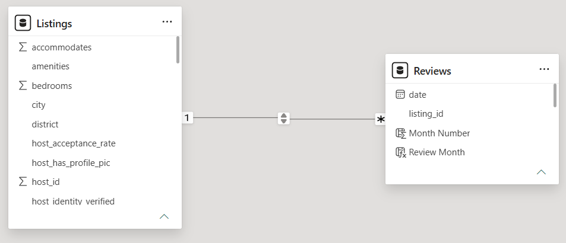
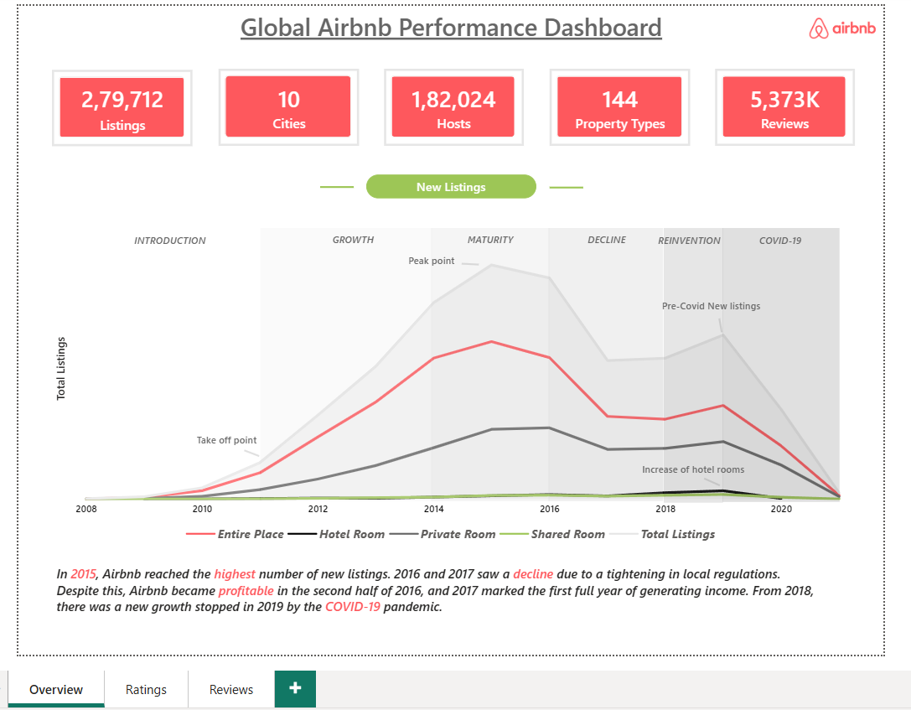
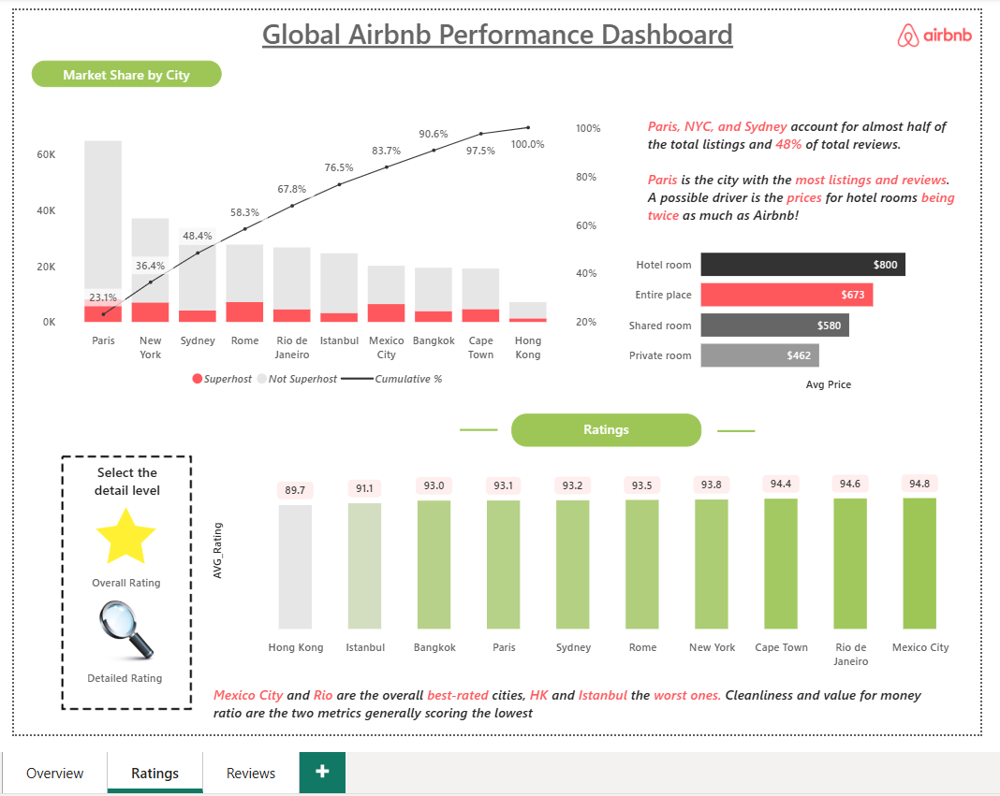
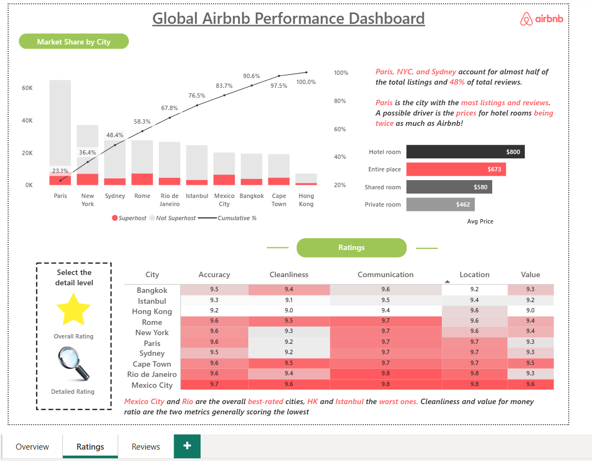
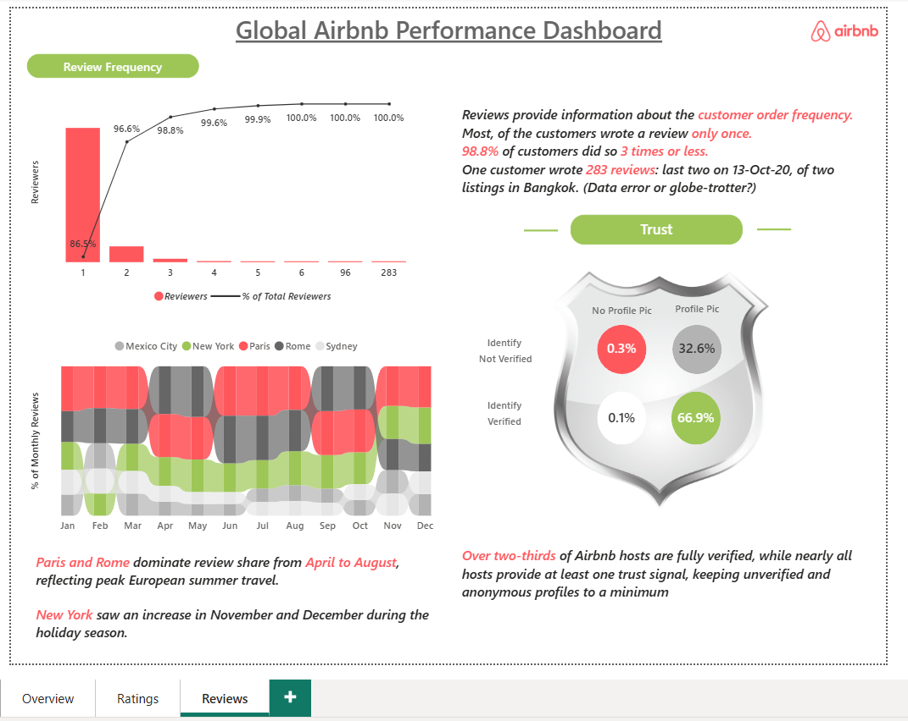

# Global Airbnb Performance Dashboard
> *An interactive Power BI dashboard analyzing 279,712 Airbnb listings across 10 global cities — uncovering trends in market share, pricing, host trust, ratings, and review behavior.*

---

## Table of Contents
1. [Project Overview](#1-project-overview)
2. [Business Questions Answered](#2-business-questions-answered)
3. [Objectives](#3-objectives)
4. [Project Scope & Tools](#4-project-scope--tools)
5. [Repository Structure](#5-repository-structure)
6. [Data Model & Schema](#6-data-model--schema)
7. [DAX Measures & Calculated Columns](#7-dax-measures--calculated-columns)
8. [Dashboard Pages & Bookmarks](#8-dashboard-pages--bookmarks)
9. [Dashboard Screenshots](#9-dashboard-screenshots)
10. [Key Insights](#10-key-insights)
11. [Deliverables](#13-deliverables)
12. [Author](#14-author)

---

## 1. Project Overview

**Context:** Airbnb operates across hundreds of cities worldwide, but performance — listings, pricing, ratings, and review activity — varies dramatically by market. Understanding these differences is critical for hosts, analysts, and platform teams alike.

**Problem Statement:** How do Airbnb listings, pricing, host trust, ratings, and review patterns differ across major global cities — and what trends have shaped the platform's growth from 2008 to the COVID-19 era?

**Approach:** Built a multi-page interactive Power BI dashboard using two datasets (Listings and Reviews) joined on `listing_id`. DAX measures were written to calculate market share, cumulative rankings, rating breakdowns, review frequency distributions, and host trust segmentation. Bookmarks were used to toggle between summary and detailed rating views.

**Outcome:** A 3-page dashboard covering platform-level overview, city ratings comparison, and review behavior analysis — surfacing actionable insights on market concentration, pricing gaps, host credibility, and seasonal review trends.

---

## 2. Business Questions Answered

This dashboard was built to answer real analytical and strategic questions across six key areas:

### 🌍 Big Picture / Overview
> *Before diving into charts, what should a stakeholder know?*
- How big is Airbnb's presence across major global cities?
- How has Airbnb grown over time and where did it peak?
- Which cities contribute most to Airbnb's overall business?
- Are listings concentrated or evenly spread across cities?

### 🏙️ Market Share by City
> *Business + strategy questions — "Where should Airbnb focus its growth, regulation, or marketing efforts?"*
- Which cities dominate Airbnb listings globally?
- Are a few cities driving most of the supply?
- How much of the total market do top cities control?
- What is the cumulative contribution of cities like Paris, NYC, and Sydney?
- Is Airbnb supply fragmented or highly concentrated?

### 🏠 Property Type & Pricing
> *Customer behavior + pricing logic — "This explains why Airbnb wins in certain markets."*
- Which property types are most commonly listed?
- Are hotel rooms more expensive than Airbnb stays?
- Why might travelers prefer Airbnb over hotels in certain cities?
- Does pricing explain higher adoption in cities like Paris?

### ⭐ Ratings & Customer Satisfaction
> *Quality & experience questions — "Where is Airbnb doing well and where is it failing customers?"*
- Which cities deliver the best overall guest experience?
- Which cities are underperforming on ratings?
- Are low ratings driven by cleanliness, value for money, or communication?
- Is high supply always equal to high quality?

### 📝 Review Frequency (Customer Behavior)
> *Very important analytical thinking section — "This shows you understand distribution, skewness, and outliers — not just visuals."*
- How often do customers actually leave reviews?
- Are reviews mostly from repeat customers or one-time users?
- What percentage of users write reviews more than once?
- Are there extreme outliers (data quality issues or power users)?
- Can reviews be trusted as a proxy for engagement?

### 📅 Seasonality Analysis
> *Demand trends over time — "This answers both business planning and host strategy questions."*
- Which cities peak during which months?
- Is Airbnb demand seasonal or stable throughout the year?
- Do European cities behave differently from non-European cities?
- When should hosts expect higher or lower demand?
- How does travel seasonality vary by geography?

### 🔐 Trust & Host Verification
> *Risk, safety & platform integrity — "This answers the most critical platform question: Can I trust Airbnb hosts?"*
- How trustworthy are Airbnb hosts overall?
- What percentage of hosts are fully verified?
- Do most hosts provide at least one trust signal?
- How rare are completely unverified and anonymous hosts?
- Is Airbnb doing enough to protect customers?

---

## 3. Objectives

- **Primary Objective:** Build an interactive dashboard that gives a comprehensive global view of Airbnb performance across 10 cities.
- **Secondary Objective 1:** Identify which cities dominate listings and reviews, and quantify market concentration.
- **Secondary Objective 2:** Analyze how listing types (Entire Place, Private Room, Shared Room, Hotel Room) differ in average pricing.
- **Secondary Objective 3:** Evaluate host trust signals (identity verification + profile picture) across the platform.
- **Secondary Objective 4:** Understand review frequency behavior — how often guests leave reviews and which cities drive seasonal review peaks.

> 💡 *Every DAX measure and visual in this dashboard traces back to one of these objectives.*

---

## 4. Project Scope & Tools

### Scope

| Dimension | Details |
|-----------|---------|
| **In Scope** | Listings and review data across 10 cities: Paris, New York, Sydney, Rome, Rio de Janeiro, Istanbul, Mexico City, Bangkok, Cape Town, Hong Kong |
| **Out of Scope** | Financial revenue data, booking conversion rates, customer demographics beyond review behavior |
| **Time Period** | Listings from 2008–2021; Reviews up to late 2020 |
| **Granularity** | Listing-level (Listings table); Review-level (Reviews table) |

### Tools & Technologies

| Category | Tool(s) Used |
|----------|-------------|
| Data Source | [Maven Analytics Data Playground](https://mavenanalytics.io/data-playground/airbnb-listings-reviews) |
| Data Storage | CSV files (`listings.csv`, `reviews.csv`) |
| Data Processing | Power Query (Power BI) |
| Analysis & Measures | DAX (Data Analysis Expressions) |
| Visualization | Microsoft Power BI Desktop |
| Version Control | Git / GitHub |
| Documentation | Markdown |

---

## 5. Repository Structure

```
global-airbnb-dashboard/
│
├── visuals/                           # Dashboard screenshots
│   ├── overview.png
│   ├── ratings_overall.png
│   ├── ratings_detailed.png
│   ├── reviews_page.png
│   └── data_model.png
│
└── README.md                          # You are here
```

> 📁 **Raw data files** are not included in this repository due to file size.
> Download the dataset directly from [Maven Analytics Data Playground](https://mavenanalytics.io/data-playground/airbnb-listings-reviews).

> 📊 **Power BI project file** (`.pbix`) is not included due to file size constraints.
> The full dashboard is documented through screenshots in the `visuals/` folder.
> To request the `.pbix` file, feel free to reach out via [LinkedIn](https://www.linkedin.com/in/yash-raj-gupta9/).

---

## 6. Data Model & Schema

The data model consists of two tables joined in a **One-to-Many** relationship:

`Listings[listing_id]` **1 → *** `Reviews[listing_id]`



### Table: `Listings`

| Field Name | Data Type | Description |
|------------|-----------|-------------|
| `listing_id` | Integer | Unique identifier for each listing (Primary Key) |
| `name` | String | Listing name/title |
| `city` | String | City where the listing is located |
| `district` | String | Neighbourhood/district within the city |
| `latitude` | Float | Geographical latitude |
| `longitude` | Float | Geographical longitude |
| `accommodates` | Integer | Maximum number of guests |
| `bedrooms` | Integer | Number of bedrooms |
| `room_type` | String | Type: Entire place / Private room / Shared room / Hotel room |
| `property_type` | String | Detailed property type (apartment, house, etc.) |
| `price` | Float | Nightly price in USD |
| `minimum_nights` | Integer | Minimum stay requirement |
| `maximum_nights` | Integer | Maximum stay allowed |
| `instant_bookable` | Boolean | Whether instant booking is enabled |
| `amenities` | String | List of amenities offered |
| `host_id` | Integer | Unique identifier for the host |
| `host_since` | Date | Date the host joined Airbnb |
| `host_is_superhost` | Boolean | Whether the host holds Superhost status (`t`/`f`) |
| `host_identity_verified` | Boolean | Whether host identity is verified (`t`/`f`) |
| `host_has_profile_pic` | Boolean | Whether host has a profile picture (`t`/`f`) |
| `host_acceptance_rate` | Float | Percentage of booking requests accepted |
| `host_response_rate` | Float | Percentage of messages responded to |
| `host_response_time` | String | Typical response time category |
| `host_location` | String | Host's stated location |
| `host_total_listings_count` | Integer | Total number of listings owned by host |
| `review_scores_rating` | Float | Overall rating score |
| `review_scores_accuracy` | Float | Accuracy sub-rating |
| `review_scores_cleanliness` | Float | Cleanliness sub-rating |
| `review_scores_checkin` | Float | Check-in experience sub-rating |
| `review_scores_communication` | Float | Communication sub-rating |
| `review_scores_location` | Float | Location sub-rating |
| `review_scores_value` | Float | Value for money sub-rating |
| `neighbourhood` | String | Neighbourhood name |

### Table: `Reviews`

| Field Name | Data Type | Description |
|------------|-----------|-------------|
| `review_id` | Integer | Unique identifier for each review |
| `listing_id` | Integer | Foreign key linking to `Listings[listing_id]` |
| `reviewer_id` | Integer | Unique identifier for the reviewer |
| `date` | Date | Date the review was submitted |
| `Month Number` | Integer | Calculated column — month number extracted from `date` |
| `Review Month` | String | Calculated column — month abbreviation (e.g., "Jan") |

> **Relationship:** `Listings[listing_id]` → `Reviews[listing_id]` | One-to-Many

---

## 7. DAX Measures & Calculated Columns

### 📊 Listings Table — Measures

#### Core Counts
```dax
Total_Listings = COUNT(Listings[listing_id])

Total Hosts = DISTINCTCOUNT(Listings[host_id])
```

#### Room Type Breakdown
```dax
Entire_Place =
CALCULATE(
    COUNT(Listings[listing_id]),
    Listings[room_type] = "Entire place"
)

Private_Room =
CALCULATE(
    COUNT(Listings[listing_id]),
    Listings[room_type] = "Private room"
)

Shared_Room =
CALCULATE(
    COUNT(Listings[listing_id]),
    Listings[room_type] = "shared room"
)

Hotel_Room =
CALCULATE(
    COUNT(Listings[listing_id]),
    Listings[room_type] = "Hotel room"
)
```

#### Superhost Segmentation
```dax
Superhost_Listings =
CALCULATE(
    COUNT(Listings[listing_id]),
    Listings[host_is_superhost] = "t"
)

Not_superhost_Listings =
CALCULATE(
    COUNT(Listings[listing_id]),
    Listings[host_is_superhost] = "f"
)
```

#### City Market Share & Ranking
```dax
City_Rank =
RANKX(
    ALL(Listings[city]),
    [Total_Listings],
    ,
    DESC
)

Cumulative_Listings =
VAR CurrentRank =
    MAXX(
        VALUES(Listings[city]),
        [City_Rank]
    )
RETURN
CALCULATE(
    [Total_Listings],
    FILTER(
        ALL(Listings[city]),
        [City_Rank] <= CurrentRank
    )
)

Cumulative_% =
DIVIDE(
    [Cumulative_Listings],
    CALCULATE([Total_Listings], ALL(Listings[city]))
)
```

#### Pricing
```dax
AVG_Price = AVERAGE(Listings[price])
```

#### Rating Sub-Scores
```dax
AVG_Rating    = AVERAGE(Listings[review_scores_rating])
Accuracy      = AVERAGE(Listings[review_scores_accuracy])
Cleanliness   = AVERAGE(Listings[review_scores_cleanliness])
Communication = AVERAGE(Listings[review_scores_communication])
Location      = AVERAGE(Listings[review_scores_location])
Value         = AVERAGE(Listings[review_scores_value])
```

#### Host Trust Segmentation
```dax
-- Verified identity + has profile picture
Verified_Profile =
CALCULATE(
    [Total Hosts],
    Listings[host_identity_verified] = "t",
    Listings[host_has_profile_pic] = "t"
)
Verified_Profile % = DIVIDE([Verified_Profile], [Total Hosts])

-- Verified identity + no profile picture
Verified_NoProfile =
CALCULATE(
    [Total Hosts],
    Listings[host_identity_verified] = "t",
    Listings[host_has_profile_pic] = "f"
)
Verified_NoProfile % = DIVIDE([Verified_NoProfile], [Total Hosts])

-- Not verified + has profile picture
NotVerified_Profile =
CALCULATE(
    [Total Hosts],
    Listings[host_identity_verified] = "f",
    Listings[host_has_profile_pic] = "t"
)
NotVerified_Profile % = DIVIDE([NotVerified_Profile], [Total Hosts])

-- Not verified + no profile picture (fully anonymous)
NotVerified_NoProfile =
CALCULATE(
    [Total Hosts],
    Listings[host_identity_verified] = "f",
    Listings[host_has_profile_pic] = "f"
)
NotVerified_NoProfile % = DIVIDE([NotVerified_NoProfile], [Total Hosts])
```

---

### 📊 Reviews Table — Calculated Columns & Measures

#### Calculated Columns
```dax
Month Number = MONTH(Reviews[date])

Review Month = FORMAT(Reviews[date], "MMM")
```

#### Core Review Counts
```dax
Total Reviews = DISTINCTCOUNT(Reviews[review_id])

Reviewers = DISTINCTCOUNT(Reviews[reviewer_id])

Reviews_per_Reviewer =
CALCULATE(
    COUNT(Reviews[review_id]),
    ALLEXCEPT(Reviews, Reviews[reviewer_id])
)
```

#### Review Frequency Distribution
```dax
Total_Reviewers =
CALCULATE(
    [Reviewers],
    ALL(Reviews[Reviews_per_Reviewer])
)

-- Filter for chart display: show only <=6 reviews or >85 (outlier band)
Show_in_Review_Frequency_Chart =
IF(
    Reviews[Reviews_per_Reviewer] <= 6
        || Reviews[Reviews_per_Reviewer] > 85,
    1,
    0
)

Cumulative_Reviewers =
VAR CurrentReviews =
    MAX(Reviews[Reviews_per_Reviewer])
RETURN
CALCULATE(
    DISTINCTCOUNT(Reviews[reviewer_id]),
    FILTER(
        ALL(Reviews[Reviews_per_Reviewer]),
        Reviews[Reviews_per_Reviewer] <= CurrentReviews
    )
)

Cumulative_%_review_frequency =
DIVIDE([Cumulative_Reviewers], [Total_Reviewers])
```

#### Monthly Review Share
```dax
% of Monthly Reviews =
DIVIDE(
    [Total Reviews],
    CALCULATE(
        [Total Reviews],
        ALLSELECTED(Listings[city])
    )
)
```

---

## 8. Dashboard Pages & Bookmarks

The dashboard is structured across **3 pages**, with a **bookmark toggle** on the Ratings page:

| Page | Key Visuals |
|------|-------------|
| **Overview** | KPI cards (Listings, Cities, Hosts, Property Types, Reviews), New Listings lifecycle trend by room type (2008–2021) |
| **Ratings** | Market share Pareto by city, Average price by room type, City ratings with bookmark toggle |
| **Reviews** | Review frequency distribution, % of monthly reviews by city, Host trust quadrant visual |

### Bookmark: Rating Detail Toggle (Ratings Page)
A bookmark-powered button allows switching between two views without leaving the page:

| Bookmark State | View |
|----------------|------|
| ⭐ **Overall Rating** | Bar chart — average overall rating score per city |
| 🔍 **Detailed Rating** | Matrix table — sub-scores per city (Accuracy, Cleanliness, Communication, Location, Value) |

---

## 9. Dashboard Screenshots

### Page 1 — Overview


The Overview page presents a platform-wide summary with **5 KPI cards** at the top — 279,712 total listings, 10 cities, 182,024 hosts, 144 property types, and 5,373K reviews. The main visual is a **New Listings trend chart** spanning 2008 to 2021, broken down by room type (Entire Place, Private Room, Hotel Room, Shared Room), with lifecycle phase annotations — *Introduction → Growth → Maturity → Decline → Reinvention → COVID-19*. This page answers the foundational question: *How has Airbnb grown over time and what phases defined its trajectory?*

---

### Page 2 — Ratings (Overall View)


The Ratings page opens with a **Pareto-style bar chart** showing market share by city, split between Superhost and Non-Superhost listings, with a cumulative percentage line. A **price comparison bar** on the right shows average nightly price by room type — Hotel Room at $800 vs Entire Place at $673. The lower section shows **average overall ratings per city** in bar form, where Mexico City (94.8) and Rio de Janeiro (94.6) lead, and Hong Kong (89.7) and Istanbul (91.1) trail.

---

### Page 3 — Ratings (Detailed View)


Using the **bookmark toggle**, switching to Detailed Rating replaces the bar chart with a **heat-map styled matrix** showing sub-scores for Accuracy, Cleanliness, Communication, Location, and Value across all 10 cities. This view makes it immediately clear that Cleanliness and Value are the two weakest dimensions globally — particularly for Istanbul and Hong Kong — answering *"Are low ratings driven by specific quality dimensions?"*

---

### Page 4 — Reviews


The Reviews page contains three visuals. The **Review Frequency chart** (top left) is a combination bar + line chart showing the distribution of how many reviews each customer wrote — 86.5% wrote exactly once, 98.8% wrote 3 or fewer, and one extreme outlier wrote 283 reviews. The **% of Monthly Reviews stacked area chart** (bottom left) shows seasonal patterns by city — Paris and Rome dominate April–August, while New York spikes in November–December. The **Trust Shield visual** (right) shows a 2×2 quadrant of host verification status, with 66.9% of hosts being fully verified with a profile picture.

---

## 10. Key Insights

**Insight 1: Paris, NYC, and Sydney dominate the market**
These three cities account for nearly half of all listings and 48% of total reviews. Paris alone holds the highest listing and review count, likely driven by hotel room prices averaging $800 — nearly double an Airbnb entire place at $673 — making Airbnb a strongly price-competitive alternative.

**Insight 2: Airbnb's new listing growth peaked in 2015, then declined**
After rapid growth from 2008 to 2015, new listings fell in 2016–2017 due to tightening local regulations. Despite this, Airbnb turned profitable in the second half of 2016. A new growth phase was cut short by COVID-19 in 2019–2020.

**Insight 3: Over two-thirds of hosts are fully verified with a profile picture**
66.9% of hosts have both identity verification and a profile picture, meaning only a tiny fraction of listings carry zero trust signals — keeping anonymous profiles to a minimum across the platform.

**Insight 4: Most guests review only once — extreme skew in review behavior**
86.5% of reviewers left exactly one review, and 98.8% wrote 3 or fewer. One outlier wrote 283 reviews — flagged as a potential data quality issue or a globe-trotter power user. This heavy right skew means reviews cannot be treated as a simple proxy for repeat engagement.

**Insight 5: Paris and Rome dominate review share April–August; New York peaks in winter**
European cities drive review activity during peak summer travel season (April–August), while New York sees a noticeable uptick in November–December during the holiday season — reflecting clear, geography-driven seasonal travel patterns.

**Insight 6: Mexico City and Rio are the best-rated cities; Cleanliness and Value score lowest globally**
Mexico City (94.8) and Rio (94.6) top overall ratings, while Hong Kong (89.7) and Istanbul (91.1) rank lowest. Cleanliness and value for money are the two sub-scores that drag down city averages most consistently — indicating where platform-level quality improvement efforts should be focused.

---

## 11. Deliverables

| Deliverable | Description | Location |
|-------------|-------------|----------|
| Dashboard Screenshots | PNG exports of all 3 dashboard pages + data model | `visuals/` |
| Raw Dataset | Available for download from Maven Analytics | [Maven Analytics Data Playground](https://mavenanalytics.io/data-playground/airbnb-listings-reviews) |
| Power BI File | `.pbix` file available on request due to size constraints | [Contact via LinkedIn](https://www.linkedin.com/in/yash-raj-gupta9/) |
| README | Full project documentation | `README.md` |

---

## 12. Author

**Yash Raj Gupta**
B.Tech Data Science Student | Aspiring Data Analyst | Microsoft PL-300 & DP-600 Certified

- 🔗 [LinkedIn](https://www.linkedin.com/in/yash-raj-gupta9/)
- 💼 [GitHub](https://github.com/knight13-1)

---

*Last updated: October 2026*
